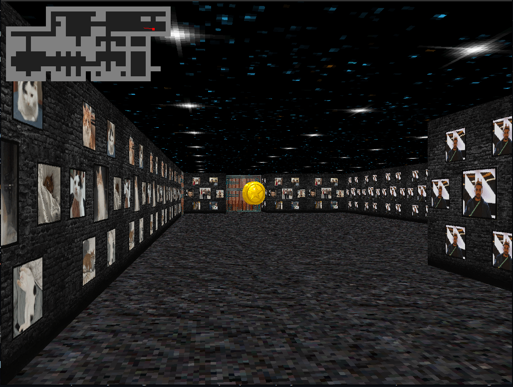
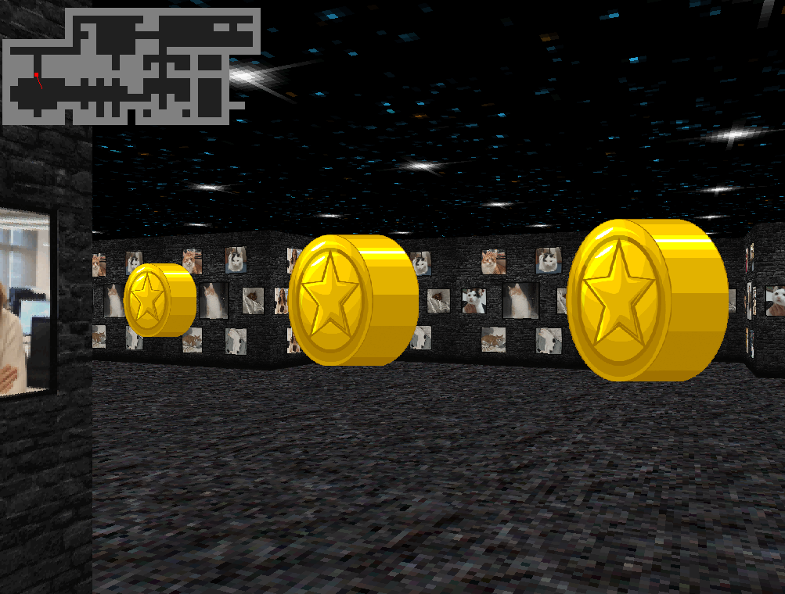
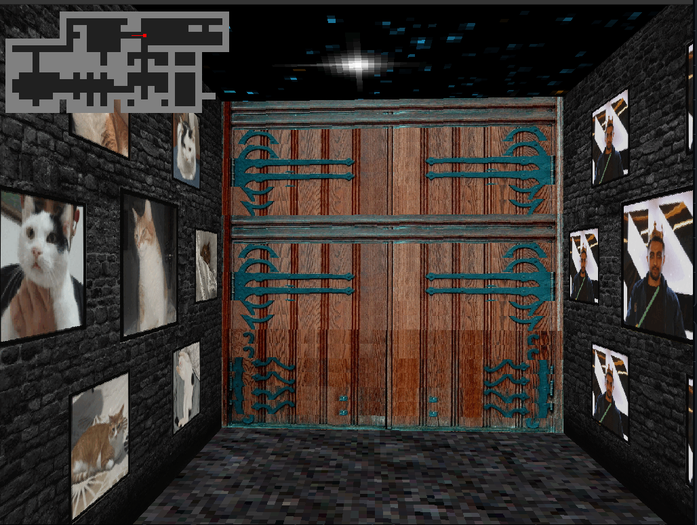

# 🧊 cub3D - A Wolfenstein 3D Raycaster

**cub3D** is a graphics project at **42 School** inspired by the world-famous 90s game *Wolfenstein 3D*. It explores the mathematical concept of **Raycasting** to create a 3D perspective projection within a 2D map environment using the **MiniLibX** library.

This project focuses on rigorous memory management, mathematical precision (DDA Algorithm), and parsing efficiency.

---

## 📸 Screenshots

| Game View |
|:---:|
|  |
|  |
|  |

---

## ✨ Features

### 🔹 Mandatory Part
* **Raycasting Engine:** Renders a 3D world from a 2D map.
* **Texture Mapping:** Different textures for North, South, East, and West walls.
* **Color Rendering:** distinct RGB colors for Floor and Ceiling.
* **Movement:** Smooth movement (W, A, S, D) and camera rotation (Left, Right arrows).
* **Deep Parsing:** Robust validation of `.cub` map files (checking for closed walls, valid paths, duplicates, etc.).
* **Memory Safety:** Zero memory leaks (verified with valgrind).

### 🚀 Bonus Part
* **Wall Collisions:** Player cannot walk through walls.
* **Minimap System:** Real-time 2D representation of the player's position and rays.
* **Mouse Rotation:** Rotate the camera view using the mouse.
* **Animated Sprites:** Rendering gold objects in the 3D world.
* **Doors:** Interactive doors (Open/Close mechanics).
* **High Performance:** Optimized rendering loop for smooth FPS.

---

## 🛠️ Installation & Usage

### Prerequisites
You need `cc`, `make`, and the `MiniLibX` dependencies installed on your system.
